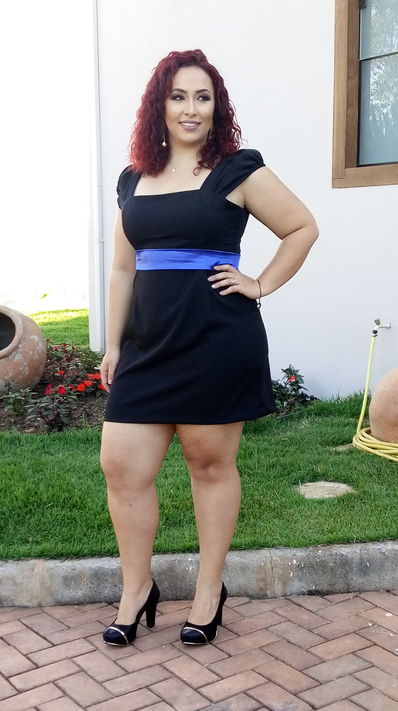

<h1 align="center">Natural ou Fake Natty? Como Vencer na Era das IAs Generativas</h1>

Olá pessoal, me chamo Kássia Moura! Inspirado na hype _"Natty or Not"_ do fisiculturismo, este Lab da DIO  é baseado no mundo das IAs Generativas, explorando o potencial dessas tendências tecnológicas incríveis! 

**Explorando as IAs Generativas**: Utilizei essas tecnologias para criar um vídeo fazendo uma breve descrição minha. Criei um Avatar meu no D-iD utilizando uma foto que já tinha e também criei um áudio a partir de um texto que digitei no ElevenLabs. 

## 💻 Projeto

Vídeo - Natural ou Fake Natty? Como Vencer na Era das IAs Generativas  

## 🚀 Tecnologias utilizadas no projeto 

Esse projeto foi desenvolvido com as seguintes tecnologias:

- [ChatGPT](https://chat.openai.com/)  
- [ElevenLabs](https://beta.elevenlabs.io/)  
- [D-iD](https://www.d-id.com/)  

## ✨ Como foi feito ?

- Roteiro criado por mim
- Roteiro corrigido via chatgpt
- Audio gerado pela ElevenLabs
- Avatar e vídeo criados com o D-iD, a partir de uma foto minha e do áudio produzido no ElevenLabs

## 🔖 Layout

Você pode visualizar a descrição do desafio deste projeto através [DESSE LINK](https://github.com/digitalinnovationone/lab-natty-or-not). 
  

## Expert

<a href="https://www.linkedin.com/in/kassia-moura-10775aa8/">LinkedIn</a>&nbsp;|&nbsp;
    <a href="https://www.instagram.com/kassia.amour/">Instagram</a>&nbsp;|&nbsp;

⌨️ com 💜 por [Kássia Almeida Moura](https://github.com/Kassia08)

  

## Bootcamp Santander 2024 - Fundamentos de IA para Devs
